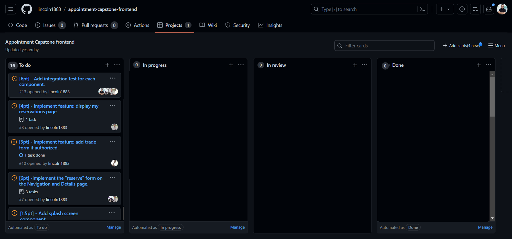

<br>
<div align='center'>
	<h1>HandyHome Hub App Front-end (API)</h1>
  </div>
<a name="readme-top"></a>

# 📗 Table of Contents
- [📖 About the Project](#about-project)
  - [🛠 Built With](#built-with)
    - [Tech Stack](#tech-stack)
    - [Key Features](#key-features)
  - [🚀 Live Demo](#live-demo)
- [💻 Getting Started](#getting-started)
  - [Prerequisites](#prerequisites)
  - [Setup](#setup)
  - [Tests](#tests)
- [👥 Authors](#authors)
- [📈 Kanban Board](#kanban)
- [🔭 Future Features](#future-features)
- [🤝 Contributing](#contributing)
- [⭐️ Show your support](#support)
- [🙏 Acknowledgements](#acknowledgements)
- [📝 License](#license)


# 🖥️ "HandyHome Hub" Front-end  <a name="about-project"></a>

**HandyHome Hub Front-end** is an application to complement our "Appointments for Home Services" project, providing a user-friendly interface for scheduling and managing home service appointments.

## ⚙️ Integration with Back-End

This front-end project is designed to seamlessly integrate with its counterpart *back-end project* 👉🏽[Appointment-capstone-backend](https://github.com/lincoln1883/Appointment-capstone-backend). The Back-end project provides the API endpoints and database for the front-end project.
## 🛠 Built With <a name="built-with"></a>

### Tech Stack <a name="tech-stack"></a>
### Built With <a name="built-with"></a>

#### Tech Stack <a name="tech-stack"></a>

<details>
  <summary>Client</summary>
  <br>
  <ul>
    <a href="https://developer.mozilla.org/en-US/docs/Web/CSS">
      
    </a>
    <br>
    <a href="https://babeljs.io/">
      
    </a>
    <br>
    <a href="https://github.com/microverseinc/linters-config/tree/master/react-redux">
      
    </a>
    <br>
    <a href="https://github.com/microverseinc/linters-config/tree/master/react-redux">
      
    </a>
    <br>
    <a href="https://webpack.js.org/">
      
    </a>
    <br>
    <a href="https://reactjs.org/">
      
    </a>
    <br>
    <a href="https://redux.js.org/">
      
    </a>
    <br>
    <a href="https://jestjs.io/">
      
    </a>
    <br>
    <a href="https://testing-library.com/docs/react-testing-library/intro/">
      
    </a>
    <br>
    <a href="https://www.netlify.com/">
      
    </a>
    <br>

  </ul>
</details>
<details>
  <summary>Server</summary>
  <br>
  <ul>
    <a href="https://github.com/Mhamad-Raad/final-capstone-backend">
      
    </a>
    <br>
  </ul>
</details>

#### Key Features <a name="key-features"></a>

- Authenticate users: Create an account by providing a valid name, e-mail, and password with password confirmation. Once your account is created, you'll be automatically logged in and can access all of the app's features.

- User-Friendly Interface: The app offers an intuitive and visually appealing user interface, ensuring a seamless experience for users of all backgrounds.

- Appointment Booking: Users can easily browse and book appointments for a wide range of home services, from cleaning to plumbing, with just a few clicks.

- Reservation Management: The app allows users to view and manage their reservations, providing a convenient overview of upcoming appointments.

- Responsive Design: Our app is responsive, ensuring a consistent and enjoyable experience on both mobile devices and desktops.

<p align="right">(<a href="#readme-top">back to top</a>)</p>

<!-- LIVE DEMO  -->

## 🚀 Live Demo <a name="live-demo"></a>

- Enjoy the live version of the app 👉🏽 [here](https://handyhomehub.netlify.app/)

<p align="right">(<a href="#readme-top">back to top</a>)</p>

<!-- GETTING STARTED -->

## 💻 Getting Started <a name="getting-started"></a>

Prerequisites and setup instructions for the project are listed below.

<!-- Prerequisites -->
### Prerequisites <a name="prerequisites"></a>

In order to run this project you need:
- Computer running MacOS, Linux or Windows
- Terminal (MacOS/Linux) or Command Line (Windows)
- Git ([Download](https://git-scm.com/downloads))
- Web browser ([Chrome](https://www.google.com/chrome/), [Firefox](https://www.mozilla.org/en-US/firefox/new/), etc.)
- Source code editor ([VSCode](https://code.visualstudio.com/), [Atom](https://atom.io/), etc.)
- Node.js (version 14.15.4 or higher) ([Download](https://nodejs.org/en/download/))
- NPM (version 6.14.10 or higher) ([Download](https://www.npmjs.com/get-npm))
- React ([Create React App](https://create-react-app.dev/docs/getting-started/))
- Redux ([React Redux](https://react-redux.js.org/))

<p align="right">(<a href="#readme-top">back to top</a>)</p>

<!-- Setup -->
### Setup <a name="setup"></a>

1. Clone the repository:

```bash
open git bash
git clone https://github.com/lincoln1883/Appointment-capstone-frontend.git
cd Appointment-capstone-frontend
```

2. Install the dependencies:

```
npm install
```

3. Modify your local environment: To setup your environment variables, you need to create a `.env` file in the root directory of the project and add the following line:

- For development: 
```bash
REACT_APP_API_URL=http://localhost:3001/api/v1
REACT_APP_API_AUTH_URL=http://localhost:3001
```
- For production:
```bash
REACT_APP_API_URL=https://appointments-ajt3.onrender.com/api/v1
REACT_APP_API_AUTH_URL=https://appointments-ajt3.onrender.com 
```

4. Start the app in a Power-Shell/bash terminal:

```bash
npm start
```

5. Open your web browser and navigate to: http://localhost:3000/ to access the application.

6. **Back End**: You need to have the back-end running in order to see the run your frontend server, please visit the [Appoinment-capstone-backend](https://github.com/lincoln1883/Appointment-capstone-backend) repository and follow the instructions in the README file.

<p align="right">(<a href="#readme-top">back to top</a>)</p>

<!-- TESTS -->
### Tests <a name="tests"></a>

**Testing Instructions**

To ensure the reliability and functionality of this project, we have included a "tests" section. 

We use React Testing Library in combination with Jest and jest-dom for our testing framework. These tools allow us to perform various types of tests, including unit tests and integration tests, ensuring that the application's components and functionality work as expected.

Follow these specific instructions to correctly run the tests using npm. 

1. Open your terminal or command prompt.

2. Navigate to the project directory using the `cd` command:
   ```
   cd path/to/your/project
   ```

3. Install project dependencies (if you haven't already) by running:
   ```
   npm install
   ```

4. Now, run the tests using the following command:
   ```
   npm test
   ```

5. Observe the test results in your terminal. Any failures or errors will be displayed, helping you identify and address any issues.

Running these tests regularly ensures that your project maintains its expected behavior and helps catch any regressions or bugs early in development.

<p align="right">(<a href="#readme-top">back to top</a>)</p>

<!-- AUTHORS -->
## 👥 Authors (in alphabetical order)<a name="authors"></a>

This project was developed by the following people:

👤 **Cosmos Hagan**
- GitHub: [cosmosha](https://github.com/Cosmosha)
- LinkedIn: [cosmoshagan](https://gh.linkedin.com/in/cosmoshagan)
- Twitter: [@hagancosmos](https://twitter.com/hagancosmos)

👤 **Ibrahim Hossain**
- GitHub: [ibugithub](https://github.com/ibugithub)
- LinkedIn: [ibuu](https://www.linkedin.com/in/ibuu/)
- Twitter: [@mdibrahimibuu](https://twitter.com/mdibrahimibuu)

👤 **Jorge Camargo**
- GitHub: [@jicamargo](https://github.com/jicamargo)
- LinkedIn: [Jorge Camargo](https://www.linkedin.com/in/jorgecamargog/?locale=en_US)
- Twitter: [@ji_camargo](https://twitter.com/ji_camargo)

👤 **Lincoln Gibson**
- GitHub: [lincoln1883](https://github.com/lincoln1883)
- LinkedIn: [lincoln-gibson](https://www.linkedin.com/in/lincoln-gibson)
- Twitter: [@lincolngibson7](https://twitter.com/lincolngibson7)

👤 **Moyasi Ginko**
- GitHub: [@MoyasiGinko](https://github.com/MoyasiGinko)
- LinkedIn: [moyasi](https://www.linkedin.com/in/moyasi/)
- Twitter: [@moyasi_ginko](https://twitter.com/moyasi_ginko)


<p align="right">(<a href="#readme-top">back to top</a>)</p>

<!-- KANBAN BOARD -->

## 📈 Kanban Board<a name="kanban"></a>

The project's kanban board is available [here](https://github.com/lincoln1883/appointment-capstone-frontend/projects/1)

You can see a screenshoot of the initial state of the board below:



<p align="right">(<a href="#readme-top">back to top</a>)</p>


<!-- FUTURE FEATURES -->
## 🔭 Future Features <a name="future-features"></a>

- [ ] **Add categories to services**
- [ ] **Add payment processing**
- [ ] **Add user profiles**
- [ ] **Add user reviews and ratings**

<p align="right">(<a href="#readme-top">back to top</a>)</p>

<!-- CONTRIBUTING -->

## 🤝 Contributing <a name="contributing"></a>

Contributions, issues, and feature requests are welcome!

Feel free to check the [issues page](https://github.com/lincoln1883/Appointment-capstone-backend/issues).

<p align="right">(<a href="#readme-top">back to top</a>)</p>

<!-- SUPPORT -->

## ⭐️ Show your support <a name="support"></a>

- If you like this project please give it a ⭐️!

<p align="right">(<a href="#readme-top">back to top</a>)</p>

<!-- ACKNOWLEDGEMENTS -->

## 🙏 Acknowledgments <a name="acknowledgements"></a>

- We would like to thank to [microverse](https://www.microverse.org/) For teaching me the database and more things.
- Thank to Murat Korkmaz on Behance for the design of the website 👉🏽.(https://www.behance.net/gallery/26425031/Vespa-Responsive-Redesign)
- Thanks a lot to everyone who will get time to check this out.


<p align="right">(<a href="#readme-top">back to top</a>)</p>

<!-- FAQ (optional) -->

<!-- LICENSE -->

## 📝 License <a name="license"></a>

This project is [MIT](./LICENSE) licensed.

<p align="right">(<a href="#readme-top">back to top</a>)</p>
